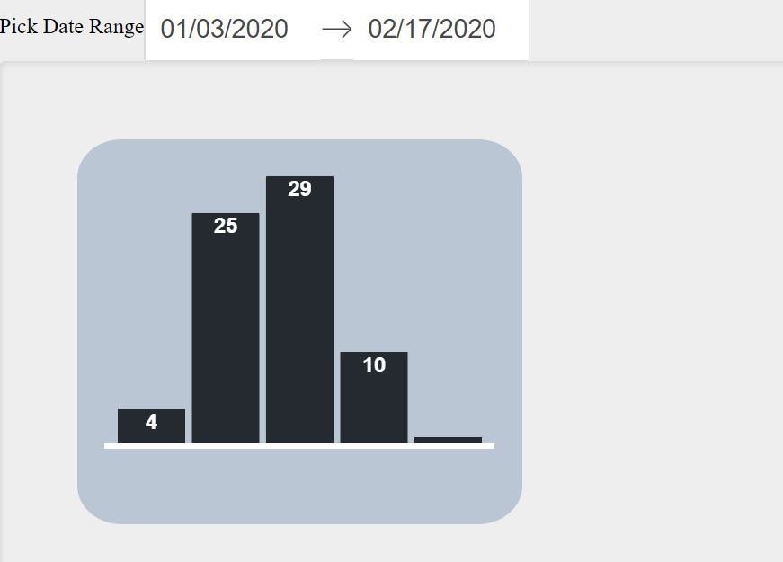
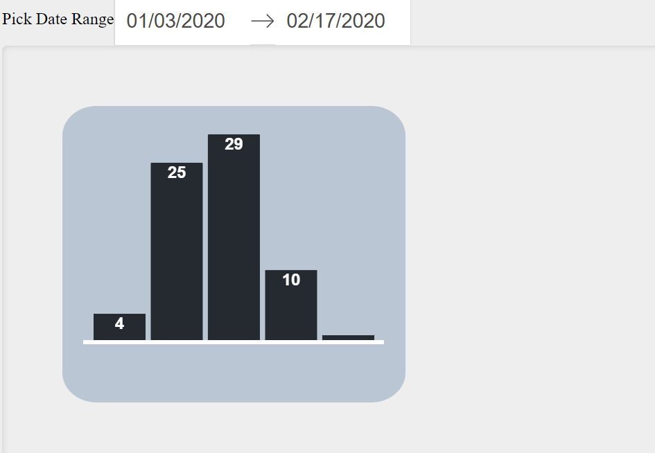
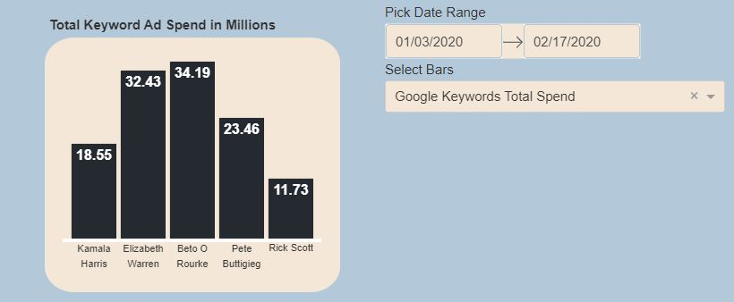
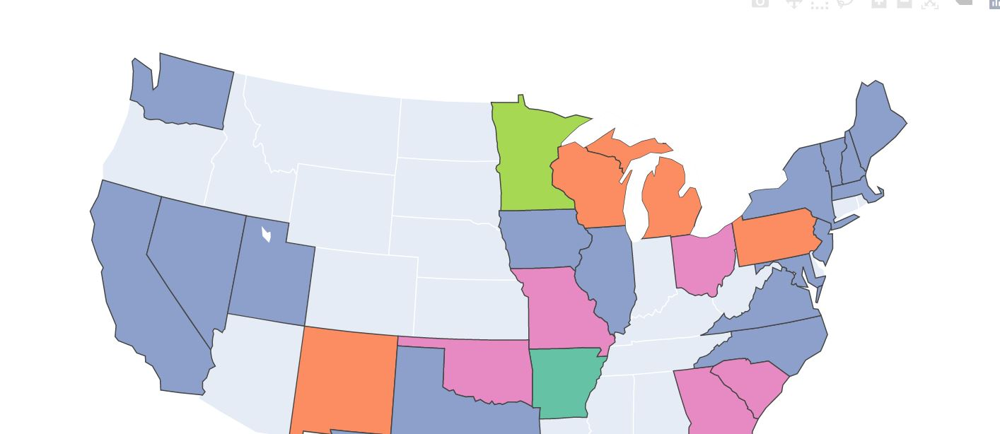
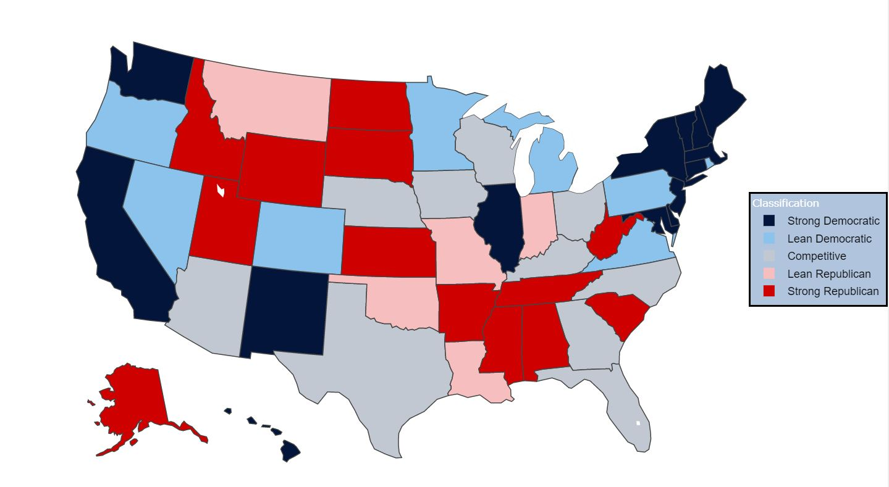
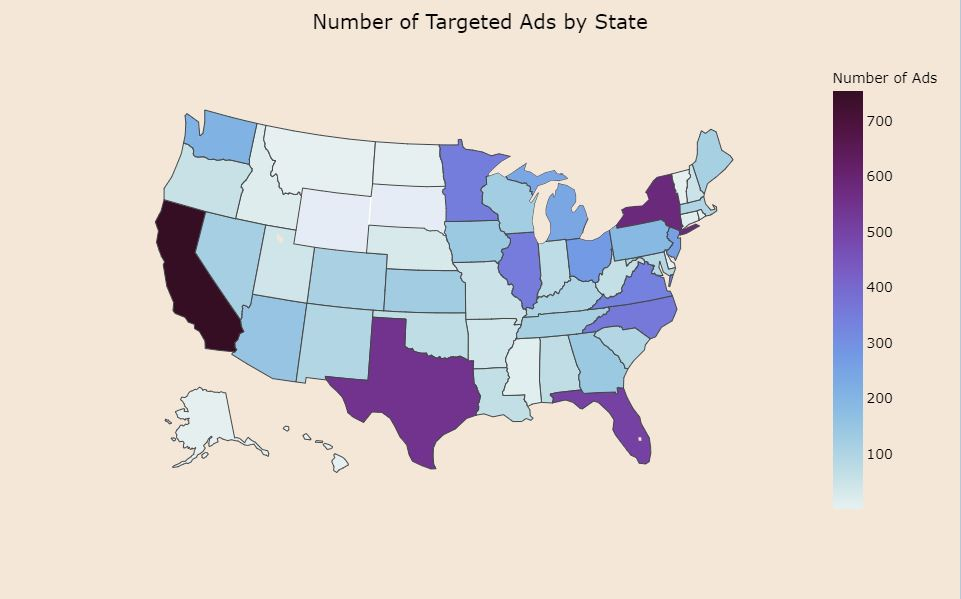
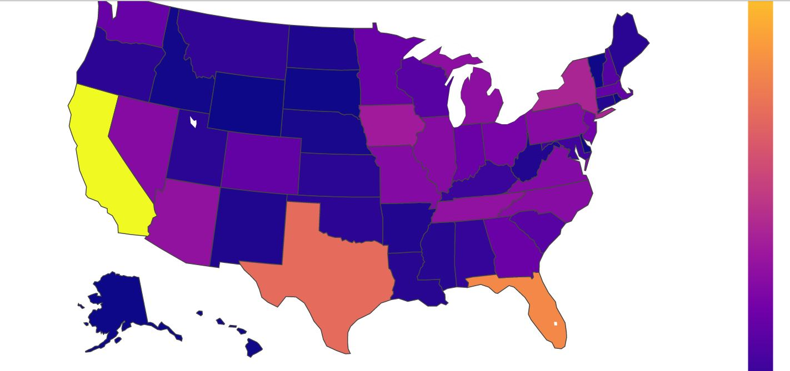

# Viz Wiz Contest Spring 2020


Please view this project on Github:  [https://github.com/gburaglia/VizWizRepo](https://github.com/gburaglia/VizWizRepo)

<p>
Our goal was to develop a creative design using innovative visualization tools. We explored mediums we didn't have previous experience with to expand our boundaries and increase our knowledge.
</p>
<p align="center">
  <a href="#data">Data</a> •
  <a href="#how-to-use">How to Use</a> •
  <a href="#visuals">Visuals</a> •
  <a href="#how-to-install">How to Install</a> •
  <a href="#methodology-and-motivation">Methodology & Motivation</a> •
  <a href="#team-members">Team Members</a> •
  <a href="#future-work">Future Work</a> •

</p>

## Data
#### Main Data Source
Google's [Political Advertising Transparency Report.](https://transparencyreport.google.com/political-ads/home) Which aims to provide transparency around political advertising on Google, YouTube, and partner properties. It includes information about targeting by ad campaign and spending by advertiser, region, and keyword.

#### Supporting Data Sources
[Polling](https://projects.fivethirtyeight.com/polls/president-primary-d/national/) information on 2020 US primary from fivethirtyeight.

[Survey](https://news.gallup.com/poll/247025/democratic-states-exceed-republican-states-four-2018.aspx) of 2018 state political party identification and leaning conducted by Gallup.

## How To Use

On first data visualization, use dropdown menu to change between "Poll Winners", "Poll Ratings", and "Keywords". For "Poll Winners" and "Poll Ratings" user can also select a specific date range and toggle between "Democratic" and "Republican" poll winners.

Scroll down on page.

On second visualization, use dropdown menu to change between "Poll Winners", "State Party Identification", "Ad Targeting", and "Ad Spending". For "Poll Winners" user can also select a specific date range.


## Visuals
| Pictures        | Description             | Details  |
| ------------- | :--------------------------| :-----------|
|| Top 5 Poll Winners by Polls Won |  Displays the top 5 winners along with their respective number of polls won across all polls in the selected date range. Users can also toggle between republican poll winners and democratic poll winners.  |
|| Top 5 Poll Winners by Percentage Share |  Displays the top 5 winners along with their respective percentage of polling results across all polls in the selected date range. Users can also toggle between republican poll winners and democratic poll winners. |
|| Top 5 Keywords by Spend |  Displays the top 5 keywords across all recorded political advertisements with their respective spend in millions.  |
|| Poll Winners by State |  Displays the winner of the latest poll in each state within the selected date range.  |
|     | Political Party Identification by State                | Each state is classified as either strong democratic, lean democratic, strong republican, lean republican, or competitive meaning there is no clear political leaning for that state. |
|    | Number of Targeted Advertisements by State | These are the number of ads that are targeted toward a specific audience in each state. Targeted characteristics include gender, age, and geographic area. |
| | Political Advertisement Spending by State    | How much is collectively spent on political advertising in each state.        |

## How To Install

This is a lightweight app that is run using python.  We used python 3.6 for development, so we would encourage you to use the same.  For installation we recommend creating a virtual environment and installing the python packages using the requirements.txt file.
You can create an environment using an Anaconda Prompt:
```
conda create -n myenv python=3.6
```
Next you would activate the environment:
```
conda activate myenv
```
To install the required packages, execute the command:
```
pip install -r requirements.txt
```

After the packages are installed, Run app.py on a local server through preferred method.
Typically shown as:
```
python app.py
```

In Google Chrome (the one and only browser we tested on), open up a new window and go to localhost, post 3050.
In our case the url is simply  http://127.0.0.1:3050/

## Methodology And Motivation

We first explored using Tableau as our visualization tool. Attracted by out-of-the-box visuals that are flexible and easily tailored to fit different data sets. As well as analysis capabilities that would help us blend different data sources and slice and dice our data quickly to explore many different views.

However, we then pivoted our focus to exploring new technologies. We decided using tools that we were unfamiliar with would force us to learn and investigate more.

With this decision, we decided to create a web application.

We leveraged several python libraries, like plotly's python library for graphing and visualizations and pandas for data manipulation and analysis. The first framework we explored was Flask, but ran into difficulty with rendering graph objects. As a result, we changed our framework to Dash, which is built on top of Flask, Plotly. js, React and React Js.

Once we had a few basic choropleth map visualizations, we explored using javascript to create other visuals. Although time intensive, we found the visual created with javascript was especially flexible and gave the most room for creativity.

## Team Members
[John Neville](https://github.com/DSNeville)

[Gabriela Buraglia](https://github.com/gburaglia)

## Future Work
Future improvements we would like to incorporate include:
 * Expand data development and extrapolation
 * Connect to Google Cloud Platform (GCP) to receive real-time data
 * Further connect visuals and allow cross-filtering between visualizations
 * Incorporate time-slicing into all data sources
